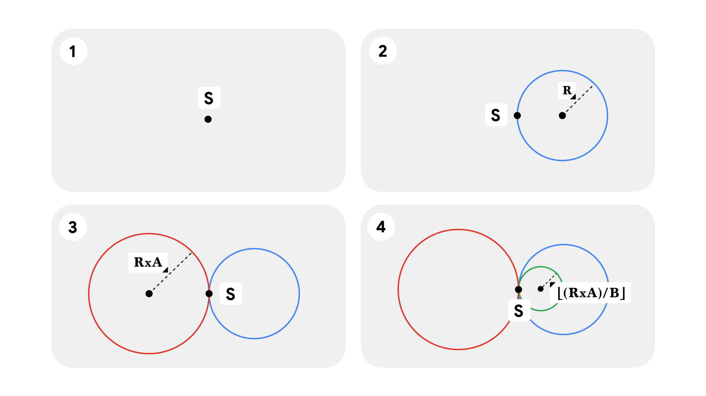

### Problem

Let us assume for the simplicity of this problem that the Infinity symbol is
made of circles which touch externally at point $S$ as shown below, and let us
call it the center of the infinity.

You are given three integers $\mathbf{R}$, $\mathbf{A}$, $\mathbf{B}$. You are
currently at the center of the infinity. You will first start drawing the right
circle with radius $\mathbf{R}$ and reach again the center of infinity. After
that, you start drawing the left circle with the radius equal to the radius of
last circle multiplied by $\mathbf{A}$. After reaching the center of the
infinity you again start drawing the right circle with radius equal to the
radius of last circle divided by $\mathbf{B}$
([integer divison](https://mathworld.wolfram.com/IntegerDivision.html)). After
reaching the center of infinity you again draw the left circle with the radius
equal to the radius of last circle multiplied by $\mathbf{A}$.

You continue to draw the left and right circles as described above until the
radius of the circle to be drawn becomes zero. Calculate the sum of areas of
all the circles drawn. It is guaranteed that the process will terminate after
finite number of steps.

### Input

The first line of the input gives the number of test cases, $\mathbf{T}$.
$\mathbf{T}$ lines follow.

Each line represents a test case and contains three integers $\mathbf{R}$,
$\mathbf{A}$, $\mathbf{B}$, where $\mathbf{R}$ denotes the radius of the first
circle, and $\mathbf{A}$ and $\mathbf{B}$ are the parameters used to calculate
the radii of the subsequent circles.

### Output

For each test case, output one line containing
<code>Case #<i>x</i>: <i>y</i></code>, where $x$ is the test case number
(starting from 1) and $y$ is the sum of areas of all the circles drawn until
radius of the circle to be drawn becomes zero.

$y$ will be considered correct if it is within an absolute or relative error of
$10^{-6}$ of the correct answer. See the
[FAQ](https://codingcompetitions.withgoogle.com/kickstart/faq#how-does-kick-start-handle-real-numbers)
for an explanation of what that means, and what formats of real numbers we
accept.

### Limits

Time limit: 20 seconds.  
Memory limit: 1 GB.

#### Test Set 1

$1 \le \mathbf{T} \le 100$  
$1 \le \mathbf{R} \le 10^5$  
$1 \le \mathbf{A} \le 500$  
$2 \times \mathbf{A} \le \mathbf{B} \le 1000$

### Sample

[Sample Input](infinity_area_sample_ts1_input.txt)

[Sample Output](infinity_area_sample_ts1_output.txt)

In Sample Case #1, you start with drawing the right circle with radius $1$
unit. After reaching the center of infinity you draw the left circle with
radius $1 \times 3=3$ units. Again after reaching the center of infinity you
stop drawing the right circle since the radius becomes $\lfloor3/6\rfloor=0$
units. Therefore the sum of areas of the circles drawn is
$\pi \times 1 \times 1 + \pi \times 3 \times 3 \approx 31.415927$.

In Sample Case #2, you start with drawing the right circle with radius $5$
units. After reaching the center of infinity you draw the left circle with
radius $5 \times 2=10$ units. After reaching the center of infinity you draw
the right circle with radius $\lfloor10/5\rfloor=2$ units. After reaching the
center of infinity you draw the left circle with radius $2 \times 2=4$ units.
After reaching the center of infinity, you stop drawing since the radius of
next circle becomes $\lfloor4/5\rfloor=0$ units. Therefore the sum of areas of
the circles drawn is
$\pi \times 5 \times 5 + \pi \times 10 \times 10 + \pi \times 2 \times 2 + \pi \times 4 \times 4 \approx 455.530935$.
